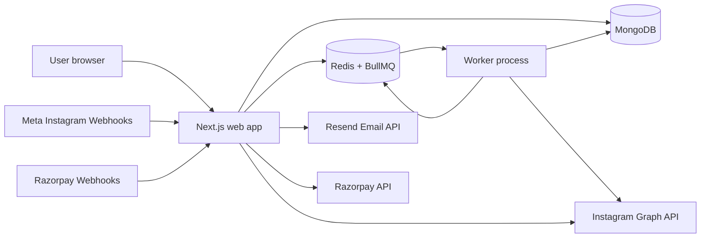
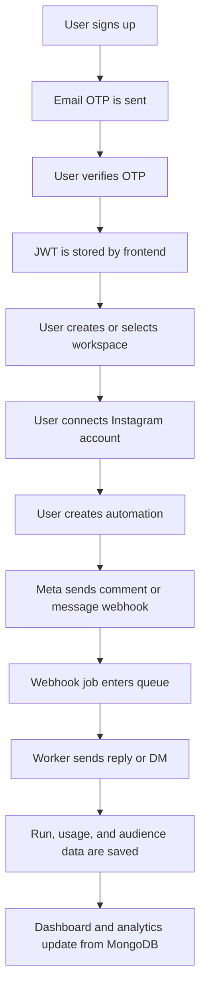
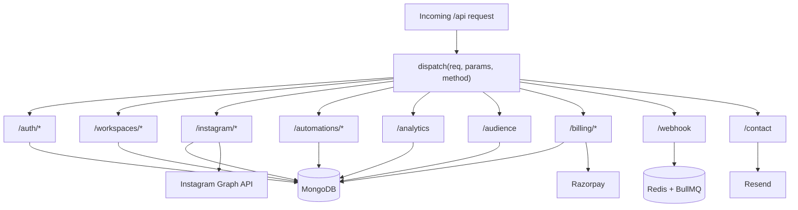
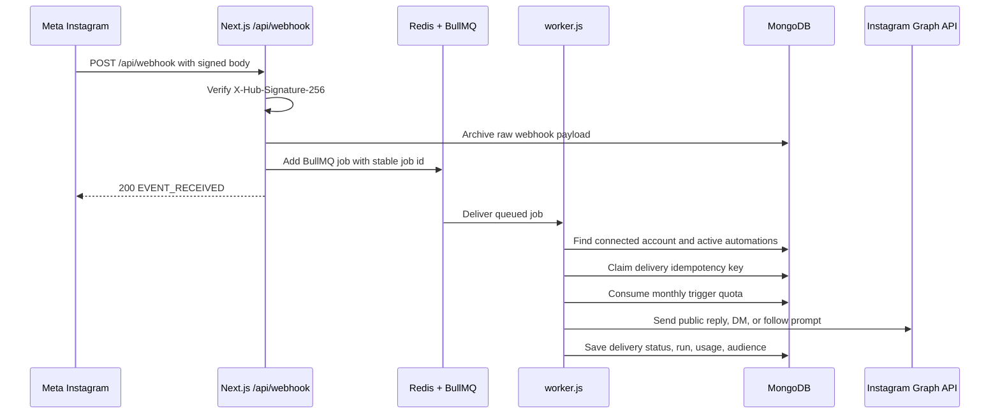
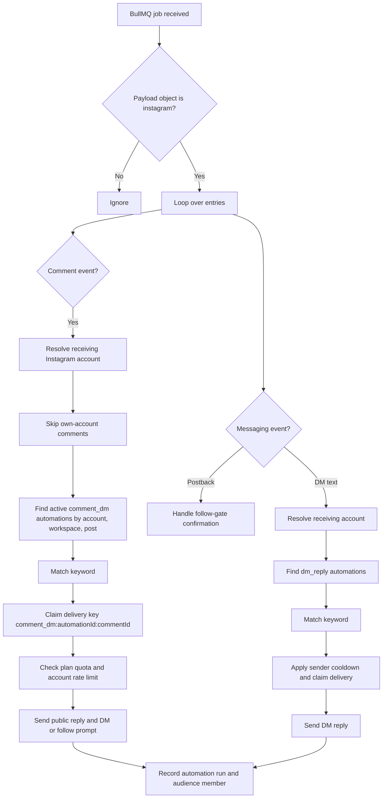
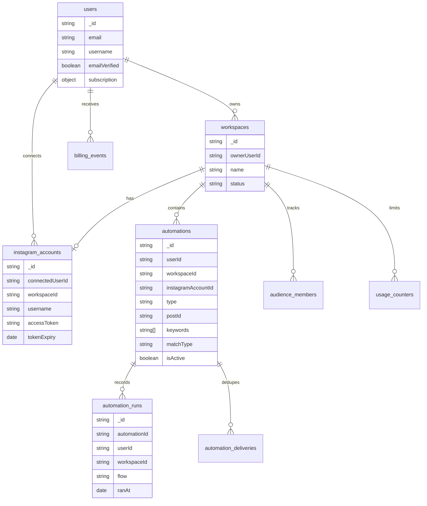

# Komentra Architecture

This document explains Komentra in simple English so you can explain the system, the tradeoffs, and how it scales.

Komentra has two main jobs:

1. Let users manage accounts, workspaces, automations, billing, analytics, and audience data.
2. React quickly to Instagram webhooks without losing events or blocking Meta.

The key design choice is this: the web app accepts webhooks fast, then a background worker does the slower Instagram Graph API work.

## Goals

- Keep Meta webhook responses fast.
- Avoid losing webhook events during traffic bursts.
- Scale by adding web servers and worker processes.
- Keep the product simple enough for a small team to operate.
- Keep all user, account, automation, billing, and analytics data in MongoDB as the source of truth.

## High-Level Architecture



### What Each Part Does

| Part | Responsibility |
| --- | --- |
| User browser | Runs the React UI for auth, dashboard, analytics, audience, billing, and contact |
| Next.js web app | Serves pages and handles all `/api/...` requests |
| MongoDB | Stores users, workspaces, accounts, automations, runs, audience, usage, billing events, and webhook archive |
| Redis + BullMQ | Buffers webhook jobs and stores short-lived rate-limit/cooldown keys |
| Worker process | Processes webhook jobs, matches automations, calls Instagram, and records results |
| Instagram Graph API | OAuth, media listing, comments, DMs, webhook subscriptions, follow checks |
| Resend | OTP and contact email delivery |
| Razorpay | Checkout, subscription state, plan changes, and payment webhooks |

## High-Level User Flow



## Low-Level Design: API Layer

All REST routes are handled by:

```text
app/api/[[...path]]/route.js
```

It works as a small router inside Next.js:



### Auth Design

- Signup creates an unverified user and sends an OTP email.
- OTP verification marks the user as verified and returns a JWT.
- Login returns a JWT only for verified users.
- Password reset sends a reset OTP and then returns a JWT after successful reset.
- Most API routes require `Authorization: Bearer <jwt>`.

Current tradeoff:

- JWT in `localStorage` is simple for an MVP.
- HttpOnly cookies would be safer for production because JavaScript cannot read them.

### Workspace Design

- A user can have multiple workspaces depending on plan limits.
- A workspace owns one Instagram account.
- Automations, analytics, usage, and audience records are scoped by workspace.
- Most dashboard routes use `X-Workspace-Id`.

Why this is useful:

- A creator can separate campaigns.
- An agency can separate client accounts.
- Plan limits can be enforced per workspace.

## Low-Level Design: Instagram Webhook Path

The webhook path is the most important scaling path.



### Why Webhook Work Is Queued

Meta expects webhook endpoints to respond quickly. Sending comments and DMs can be slow because it depends on Instagram Graph API latency and rate limits.

If the web request did all work inline:

- One slow Graph API call could delay the webhook response.
- A burst of comments could overload the web server.
- Meta could retry or disable webhooks if responses are too slow.

With the queue:

- The web app only verifies, archives, enqueues, and responds.
- Workers handle slow work in the background.
- More workers can be added without changing the API.

## Low-Level Design: Worker Logic



Worker responsibilities:

- Resolve which connected Instagram account received the event.
- Ignore events from the account itself.
- Match active automations by workspace, account, post, and keyword.
- Enforce idempotency with `automation_deliveries`.
- Enforce monthly trigger quota with `usage_counters`.
- Enforce per-account hourly send limit using Redis.
- Save analytics in `automation_runs`.
- Save audience data in `audience_members`.
- Pause account automation temporarily when Graph API errors indicate risk.

## Data Model



## Main Runtime Flows

### 1. Signup And Login

```text
POST /api/auth/signup
  -> create or update unverified user
  -> save OTP and expiry
  -> send OTP email
  -> return needsVerification

POST /api/auth/verify-otp
  -> check OTP and expiry
  -> mark emailVerified
  -> return JWT and user

POST /api/auth/login
  -> compare password
  -> reject unverified users
  -> return JWT and user
```

### 2. Connect Instagram Account

```text
GET /api/instagram/connect
  -> require JWT
  -> require active workspace
  -> enforce plan account limit
  -> create short-lived oauth_states row
  -> return Meta OAuth URL

GET /api/instagram/callback
  -> consume oauth_states row
  -> exchange code for short token
  -> exchange short token for long token
  -> fetch Instagram account info
  -> save instagram_accounts row
  -> subscribe account to webhook fields
```

### 3. Create Automation

```text
POST /api/automations
  -> require JWT and workspace
  -> verify instagramAccountId belongs to user and workspace
  -> validate automation type
  -> enforce active automation plan limit
  -> for comment_dm, prevent duplicate active automation on same post/account/workspace
  -> insert automation
```

### 4. Billing

```text
POST /api/billing/checkout
  -> require JWT
  -> create or reuse Razorpay customer
  -> create Razorpay subscription
  -> save pending subscription state
  -> return checkout data

POST /api/billing/webhook
  -> verify Razorpay signature
  -> dedupe event
  -> update user subscription state
```

## Scaling Plan

### Small Scale

Good for early users and internal testing.

```text
1 Next.js process
1 worker process
1 Redis instance
1 MongoDB Atlas cluster
```

Simple and cheap. The worker can run on the same machine as the web app if traffic is low.

### Medium Scale

Good for many active customers and regular webhook traffic.

```text
2+ Next.js web instances
3+ worker processes
Managed Redis
MongoDB Atlas replica set
Centralized logs
```

Why it scales:

- Web instances are mostly stateless.
- BullMQ distributes jobs across workers.
- MongoDB remains the source of truth.
- Redis buffers traffic spikes.

### Large Scale

Good for high-volume webhook traffic.

```text
Auto-scaled Next.js web tier
Many worker processes
Managed Redis with high availability
MongoDB Atlas larger replica set or sharded cluster
Metrics and alerting
Dedicated scheduled jobs for token refresh and cleanup
```

At this stage, scale workers based on queue length and job age, not just CPU.

## What To Scale First

| Bottleneck | Symptom | Scale / Fix |
| --- | --- | --- |
| Web tier | Webhook request latency rises | Add Next.js instances |
| Worker tier | Queue length grows, jobs wait too long | Add worker processes or raise `WORKER_CONCURRENCY` carefully |
| Instagram Graph API | Rate-limit errors or account pauses | Lower per-account send rate, add smarter retry/backoff |
| Redis | Queue operations slow or Redis memory high | Move to managed Redis with more memory/HA |
| MongoDB | Slow analytics or high write latency | Add indexes, use aggregations, upgrade cluster |
| Analytics endpoint | Page slow for large accounts | Move aggregation into MongoDB pipelines |

## Current Reliability Features

- Webhook HMAC verification using `X-Hub-Signature-256`.
- Stable BullMQ job IDs based on webhook body hash.
- BullMQ retry settings at the queue level.
- Delivery idempotency through `automation_deliveries`.
- Sender cooldowns for DM and follow-gate flows.
- Per-account hourly send limit using Redis.
- Account pause after risky Graph API errors.
- Workspace status checks before automation sends.
- Plan quota checks before trigger consumption.
- Razorpay webhook signature verification and event dedupe.

Important honesty:

- Some worker send failures are caught and recorded instead of being thrown back to BullMQ, so not every transient Graph failure currently retries.
- Instagram access tokens are stored in MongoDB as plaintext today.
- Instagram token refresh is not automated yet.
- Raw webhook payload retention needs a TTL policy.

## Tradeoffs

### One Next.js API Instead Of Separate Services

Why this was chosen:

- Easy to build and deploy.
- One codebase for frontend and backend.
- Shared helpers for auth, MongoDB, plans, billing, and Instagram.
- Good enough until traffic proves a real split is needed.

Tradeoff:

- The catch-all route can become large.
- Clear section comments and tests matter more as the app grows.

### Queue-Based Webhook Processing

Why this was chosen:

- Meta gets a fast response.
- Slow Instagram API calls do not block web requests.
- Workers can scale separately.
- Redis can absorb short traffic bursts.

Tradeoff:

- More moving parts: Redis and worker process must be running.
- Debugging needs both web logs and worker logs.

### MongoDB As Main Database

Why this was chosen:

- Flexible document shape for automations, webhook payloads, and provider data.
- Fast iteration while the product shape is changing.
- Works well with Atlas for managed deployment.

Tradeoff:

- Important uniqueness and reporting guarantees depend on good indexes.
- Large analytics queries need aggregation pipelines, not in-memory filtering.

### JWT In Local Storage

Why this was chosen:

- Simple frontend implementation.
- No CSRF work needed for the MVP.

Tradeoff:

- XSS would expose the token.
- HttpOnly secure cookies are the safer production direction.

### Per-Account Rate Limits

Why this was chosen:

- Instagram limits are tied to account behavior.
- A noisy account should not pause every customer.

Tradeoff:

- Worker throughput cannot be scaled blindly; Graph API limits still matter.
- Queue length can grow if many accounts hit send limits.

## Operations

### Start Locally

```bash
yarn dev
node worker.js
```

MongoDB and Redis must also be running.

### Build

```bash
npm.cmd run build
```

### Inspect Queue

```bash
redis-cli
LLEN bull:webhook-events:wait
LLEN bull:webhook-events:active
LLEN bull:webhook-events:failed
```

### Useful Worker Environment Variables

| Variable | Meaning |
| --- | --- |
| `WORKER_CONCURRENCY` | Jobs a worker can process in parallel |
| `DM_AUTOMATION_COOLDOWN_SECONDS` | Cooldown before the same DM automation replies to same sender again |
| `FOLLOW_RETRY_COOLDOWN_SECONDS` | Cooldown for follow-gate retry/confirmation prompts |
| `META_ACCOUNT_SEND_LIMIT_PER_HOUR` | Per-account send cap enforced by Redis |
| `GRAPH_ERROR_PAUSE_MINUTES` | Pause duration after risky Graph API errors |
| `RATE_LIMIT_PAUSE_MINUTES` | Pause duration after internal send limit is exceeded |
| `AUTOMATIONS_PAUSED` | Global switch to stop automation sends |

## Production Improvements To Prioritize

1. Hash OTPs and rate-limit auth/reset endpoints.
2. Encrypt Instagram access tokens.
3. Add automatic Instagram token refresh.
4. Throw retryable worker send failures so BullMQ can retry them.
5. Add webhook archive TTL and redaction.
6. Move heavy analytics to MongoDB aggregation pipelines.
7. Add centralized logs, metrics, and alerts for queue age, worker failures, Graph errors, and webhook latency.
8. Move JWT auth to HttpOnly secure cookies when ready.

